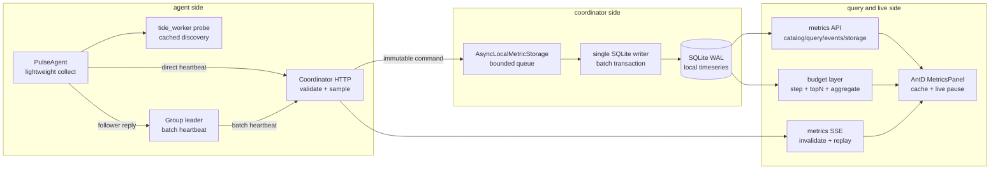
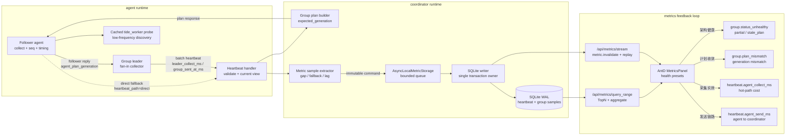

# Coordinator 本地存储与时序展示设计

## 结论

每个 Pulse coordinator 增加本地嵌入式时序存储，用于保存本 coordinator 观察到的 heartbeat 与 agent 运行状态历史数据。第一版使用 SQLite 作为本地数据库，按时间分桶、按 host 索引，并通过 coordinator Web API 与 SSE 向前端提供类似 Grafana 的 range query 和增量刷新数据。

第一版落地范围：

- 统计每个 host 的 heartbeat 延迟、到达时间、处理耗时、状态和消息大小。
- 统计每个 host 上 tide_worker 进程的 pid、版本、cpu、rss、线程数、端口、debug 信息和 leader/follower 信息。
- 统计每个 group leader 的批量上报、成员覆盖、拒绝/回退、收集耗时和 leader 稳定性，用于后续通过本地 DB 评估 group 心跳上报方案。
- 前端新增 dashboard/time-series 数据层，支持 range、step、series、downsample、SSE 增量刷新和优雅重连。
- 每个 coordinator 只保存本地观察数据，不在第一版做跨 coordinator 全局聚合。

核心约束：

- 不引入外部数据库、Kafka、Prometheus 或远程 TSDB；coordinator 必须单机可运行。
- 本地存储是 coordinator 的可观测性缓存，不是控制面的强一致状态源。
- 写入路径不能阻塞 heartbeat 快路径；必须通过异步队列批量落盘。
- SQLite 写入层必须架构性保证单并发写入：单 writer 线程独占 connection、transaction 和 prepared statement，不允许 handler 或查询线程直接写库。
- UI 查询不能扫描全表；所有查询必须使用时间范围、agent/cluster/area 过滤和步长下采样。
- 前端实时更新默认使用 SSE，不再新增 HTTP polling；现有 polling 调用需要迁移到 SSE 事件流。
- 数据必须有 TTL、容量上限、降级策略和损坏恢复策略。

## 架构图

第一版采用“heartbeat 热路径轻量化、SQLite 写入异步化、查询预算服务端化、前端渐进渲染”的分层架构。



关键边界：

- Agent 热路径只做轻量采集、序列号递增、payload 编码和 HTTP 发送；不能在每次 heartbeat 做全量 `/proc` 扫描或创建长生命周期资源。
- Group leader 是 fan-in 优化层，不是唯一事实源；leader 异常时 coordinator 仍可接收 direct heartbeat，并通过 `heartbeat_path`、`group_mode`、`group_leader_sample` 诊断覆盖率。
- Coordinator handler 只构造不可变 sample 并入队；SQLite transaction、TTL cleanup、WAL checkpoint 全部在 writer 侧串行执行。
- Query API 必须先执行 series/point budget，再返回 `truncated`、`suggested_step_ms`、TopN 明细和 aggregate 聚合线，前端必须诚实展示降级状态。
- SSE 只负责 invalidation 和 bounded replay；断线或不可见页面由前端补偿查询和 live pause 控制，避免后台页面持续消耗资源。

### 心跳链路架构图

心跳链路必须同时满足三个目标：agent 热路径极轻、group fan-in 可退化、metrics 能直接证明链路健壮性和采集实效性。因此架构上把控制面 plan 下发、数据面 heartbeat 上报、观测面 SQLite/SSE 查询分开建模。



链路语义：

- `Follower agent -> Group leader -> Coordinator` 是正常低请求数路径，group leader 只做批量转发和轻量统计，不承载唯一事实源。
- `Follower agent -> Coordinator` 的 direct fallback 是架构级安全阀，必须保留并结构化记录；它的健康判断不能只看平均值，要看 p95/p99 和 max。
- `heartbeat_path` 只能表达链路类别，如 `direct`、`fallback_direct`、`group_leader_batch`；具体 `group_id` 必须进入独立 label 或 metadata，不能污染 path 维度，否则无法聚合判断架构是否退化。
- `cluster=unknown` 的 agent 不能进入 group leader 规划，只能保持 direct；缺失 cluster 元数据时做 group fan-in 可能把不相关 host 编入同一个 group。
- `Group plan builder -> Agent` 是控制面，`expected_generation` 与 agent 上报的 `agent_plan_generation` 必须用可解释语义比较，不能让观测指标依赖不可排序的 hash。
- `Metric sample extractor -> SQLite writer` 是观测面，写入异步化是硬边界；任何 SQLite busy、checkpoint、cleanup 都不能反压 heartbeat handler。
- `SQLite -> Metrics API/SSE -> MetricsPanel` 是反馈面，preset 必须直接回答“架构是否退化、plan 是否收敛、agent 采集是否新鲜、发送链路是否轻量”。

### 当前 metrics 反推的设计修正

线上 SQLite 与 Metrics Panel health preset 已经能证明一部分设计假设，也暴露了当前指标语义的缺陷：

- 心跳可见性符合预期：三个 coordinator 在 1 小时窗口均观察到 `471` 个 agent，`cdn2` 均为 `50/50`，说明当前链路没有整体不可见问题。
- 到达间隔符合 5s heartbeat 设计：整体 arrival p95 约 `5.1s`，`cdn2` p95 约 `5.0s`，p99 低于 10s，说明低资源路径没有明显牺牲数据新鲜度。
- agent 发送与 group leader 链路成本较低：`heartbeat.agent_send_ms` p95 约 `2ms`，`group.group_latency_ms` p95 约 `1-2ms`，说明热路径 timing instrumentation 已能验证轻量化目标。
- `group.group_latency_ms` 与 `group.arrival_gap_ms` 必须拆开解释：前者是 leader batch 发送到 coordinator 的链路耗时；后者是单 coordinator 本地观察到同一 group 的样本间隔。
- group leader 不应通过成功后轮询多个 coordinator 来制造本地样本覆盖；coordinator 之间已有 `/heartbeat_fwd` 做最终一致性，agent/coordinator 发送应使用稳定 sticky target，只有失败时 failover。
- 在 3 coordinator、5s heartbeat 下，如果客户端成功后轮询，单 coordinator 的 `group.arrival_gap_ms` 会稳定接近 15s；这是发送策略与指标语义的设计缺陷，不是 group 链路真实延迟。
- `partial`、`stale_plan` 和少量 `seq_gap` 仍存在尾部样本，因此 UI 必须展示 TopN、p99/max 和事件，不允许只用平均值表达健康。
- `group.direct_fallback_count` p95/p99 大多为 `0`，但 `cdn2` 单窗口 max 可达 `5-10`，说明 direct fallback 是低频尾部事件，必须作为退化信号保留。
- `group.plan_lag` 当前语义存在设计/实现缺陷：如果 `plan_generation` 是 unsigned hash，则只有相等/不相等语义，不能执行 `expected_generation - agent_plan_generation`；当前线上出现数十亿级 `plan_lag`，更像指标语义错误或冷启动混入，而不是实际传播延迟。
- 当前线上 `heartbeat_path` 出现大量具体 group id，说明实现把 source group id 写进了 path 字段；这会让“direct/fallback/group batch”健康判断依赖字符串解析，必须修正为类别维度。
- 当前线上仍出现 `unknown/unknown/*` group path，说明缺失 cluster 元数据的 agent 被 group 化；这属于安全边界缺陷，应让 unknown cluster 保持 direct，直到元数据补齐。

因此 `group.plan_lag` 不能继续作为 hash 差值使用，健康 preset 应优先使用 `group.plan_mismatch`：

- 如果 generation 继续使用 hash，指标使用 `group.plan_mismatch`，值为 `0/1` 或按成员数计数。
- 如果需要表达“滞后多少代”，generation 必须改为 coordinator 侧单调递增版本，并带上 cluster/area/group 作用域和 rollout epoch。
- `agent_plan_generation` 为 `0` 或缺失时应标记为 `unknown/cold_start`，不能参与 lag 数值聚合。
- `expected_generation`、`agent_plan_generation`、`plan_lag`、`reject_reason_json` 应从 `debug_json` 升级为结构化列，避免 health preset 依赖 JSON extraction。

## 非目标

- 不实现跨 coordinator 的全局一致查询。
- 不替代现有 `/api/hosts` 当前态接口。
- 不把本地库作为任务执行、文件下发或 shell 输出的唯一事实源。
- 不保存完整 heartbeat 原始 JSON 长期历史；只保存可查询指标和必要事件摘要。
- 不在第一版引入 WebSocket。实时增量通道使用 SSE，避免双向协议复杂度；HTTP 仅保留初始化查询、补偿查询和手动刷新。

## 数据库选择

### 选择 SQLite

第一版使用 SQLite，数据库文件默认位于：

```text
${PULSE_COORDINATOR_DATA_DIR:-${install_root}/coordinator}/pulse-local.db
```

推荐配置：

```sql
PRAGMA journal_mode = WAL;
PRAGMA synchronous = NORMAL;
PRAGMA temp_store = MEMORY;
PRAGMA busy_timeout = 5000;
PRAGMA foreign_keys = ON;
```

选择 SQLite 的原因：

- 嵌入式单文件部署，符合当前 coordinator 单 JAR / systemd 部署模式。
- Java 生态成熟，读写路径简单，运维成本低。
- WAL 模式支持一个 writer、多个 reader，适合 coordinator 单进程批量写入 + UI 查询。
- 对 50 至数百 host、秒级 heartbeat、数天保留的规模足够。
- 支持普通 SQL、索引、聚合、窗口查询和在线备份。

SQLite 使用约束：

- SQLite 不是高并发写入引擎，不能让多个业务线程共享写 connection 或竞争写事务。
- 写入层必须显式建模为单 writer ownership：只有 `SqliteMetricWriter` 线程持有 write connection。
- heartbeat handler、SSE 推送线程、查询线程都不能直接执行 `INSERT`、`UPDATE`、`DELETE`。
- 所有写入命令必须先转为不可变 `MetricWriteCommand`，经由队列进入 writer 线程。
- 查询使用只读 connection，设置 `query_only` 语义，不复用 writer 的 prepared statement。
- TTL 清理、rollup、schema migration 也属于写操作，必须由 writer 线程串行执行或在启动阶段 writer 未运行前执行。

### 不选择其他方案

DuckDB：

- 优点是列式分析强，适合离线聚合。
- 缺点是高频小批写入、长驻服务并发查询和 WAL 语义不如 SQLite 简单。
- 可作为后续离线导出或历史归档格式，不作为第一版在线库。

H2：

- 优点是纯 Java、集成简单。
- 缺点是生产运维经验和时序查询生态弱于 SQLite，文件损坏恢复和 CLI 诊断不如 SQLite 直接。

RocksDB：

- 优点是写入强。
- 缺点是查询模型需要自建二级索引和聚合，前端 range query 会复杂化。

Prometheus remote write / VictoriaMetrics / TimescaleDB：

- 优点是时序能力完整。
- 缺点是引入外部依赖，不符合“每个 coordinator 本地存储”的目标。

## 数据模型

### 时间语义

所有时间字段使用 Unix epoch milliseconds：

- `observed_at_ms`：coordinator 收到并开始处理 heartbeat 的本地时间。
- `agent_sent_at_ms`：agent 生成 heartbeat 的时间，由 heartbeat payload 上报。
- `collector_sent_at_ms`：group heartbeat 场景中 leader/collector 转发时间，可选。
- `leader_collected_at_ms`：group leader 完成本轮 follower 收集并准备提交的时间，可选。
- `stored_at_ms`：写入本地库时间。

heartbeat 延迟定义：

```text
heartbeat_latency_ms = observed_at_ms - agent_sent_at_ms
```

如果 agent 没有上报 `agent_sent_at_ms`，延迟为 `NULL`，但仍记录 `arrival_gap_ms`：

```text
arrival_gap_ms = observed_at_ms - previous_observed_at_ms(agent_id)
```

### 维度表：`host_dimension`

保存 host 最新维度信息，供查询时过滤和展示。

```sql
CREATE TABLE IF NOT EXISTS host_dimension (
  agent_id             TEXT PRIMARY KEY,
  ip                   TEXT NOT NULL,
  normalized_ip        TEXT NOT NULL,
  cluster              TEXT NOT NULL DEFAULT 'unknown',
  area                 TEXT NOT NULL DEFAULT 'unknown',
  host_group           TEXT NOT NULL DEFAULT 'unknown',
  mode                 TEXT NOT NULL DEFAULT 'unknown',
  coordinator_id       TEXT NOT NULL,
  first_seen_ms        INTEGER NOT NULL,
  last_seen_ms         INTEGER NOT NULL,
  last_status          TEXT NOT NULL,
  last_heartbeat_seq   INTEGER,
  metadata_json        TEXT
);

CREATE INDEX IF NOT EXISTS idx_host_dimension_cluster
  ON host_dimension(cluster, area, host_group);

CREATE INDEX IF NOT EXISTS idx_host_dimension_ip
  ON host_dimension(normalized_ip);
```

说明：

- `agent_id` 是稳定主键。
- `normalized_ip` 用于排序和前端展示稳定性。
- `metadata_json` 只保存低频变更字段，不保存每次 heartbeat 全量。

### 时序表：`heartbeat_sample`

保存 per host heartbeat 观测样本。

```sql
CREATE TABLE IF NOT EXISTS heartbeat_sample (
  bucket_ms             INTEGER NOT NULL,
  observed_at_ms        INTEGER NOT NULL,
  agent_id              TEXT NOT NULL,
  heartbeat_seq         INTEGER,
  status                TEXT NOT NULL,
  agent_sent_at_ms      INTEGER,
  latency_ms            INTEGER,
  arrival_gap_ms        INTEGER,
  coordinator_process_ms INTEGER,
  request_bytes         INTEGER,
  response_bytes        INTEGER,
  message_count         INTEGER,
  error_code            TEXT,
  stored_at_ms          INTEGER NOT NULL,
  PRIMARY KEY (agent_id, observed_at_ms)
);

CREATE INDEX IF NOT EXISTS idx_heartbeat_sample_time
  ON heartbeat_sample(bucket_ms, observed_at_ms);

CREATE INDEX IF NOT EXISTS idx_heartbeat_sample_agent_time
  ON heartbeat_sample(agent_id, observed_at_ms);

CREATE INDEX IF NOT EXISTS idx_heartbeat_sample_status_time
  ON heartbeat_sample(status, observed_at_ms);
```

字段说明：

- `bucket_ms` 是按写入配置对 `observed_at_ms` 取整后的时间桶，如 10s 或 60s，用于快速 group by。
- `latency_ms` 可能为 `NULL`，前端需按 missing point 处理。
- `arrival_gap_ms` 用于识别 heartbeat 间隔异常、agent 卡顿或链路抖动。
- `coordinator_process_ms` 是 coordinator 处理 heartbeat 的本地耗时。

### 时序表：`tide_worker_sample`

保存 tide_worker 进程样本。一个 host 上可能有多个 tide_worker，因此主键包含 pid。

```sql
CREATE TABLE IF NOT EXISTS tide_worker_sample (
  bucket_ms             INTEGER NOT NULL,
  observed_at_ms        INTEGER NOT NULL,
  agent_id              TEXT NOT NULL,
  pid                   INTEGER NOT NULL,
  version               TEXT,
  role                  TEXT,
  leader                TEXT,
  area                  TEXT,
  group_name            TEXT,
  cpu_pct               REAL,
  usr_pct               REAL,
  sys_pct               REAL,
  mem_pct               REAL,
  rss_kb                INTEGER,
  thread_count          INTEGER,
  port                  INTEGER,
  age_seconds           INTEGER,
  mode                  TEXT,
  size_current          INTEGER,
  size_total            INTEGER,
  debug_json            TEXT,
  stored_at_ms          INTEGER NOT NULL,
  PRIMARY KEY (agent_id, observed_at_ms, pid)
);

CREATE INDEX IF NOT EXISTS idx_tide_worker_time
  ON tide_worker_sample(bucket_ms, observed_at_ms);

CREATE INDEX IF NOT EXISTS idx_tide_worker_agent_time
  ON tide_worker_sample(agent_id, observed_at_ms);

CREATE INDEX IF NOT EXISTS idx_tide_worker_role_time
  ON tide_worker_sample(role, observed_at_ms);
```

说明：

- `debug_json` 保存低频调试字段，如 leader、mode、group、size 等未结构化扩展。
- 高频可画图字段必须结构化，例如 `cpu_pct`、`rss_kb`、`thread_count`。
- 如果某次 heartbeat 没有 tide_worker，写入一条 host 级状态事件，而不是写入 pid=0 的伪样本。

### 时序表：`group_leader_sample`

保存 group leader 每轮批量上报的观测样本。该表面向后期 SQL 分析，用于评估 group 心跳方案是否真实降低 coordinator 请求压力，并定位 leader/follower 协议抖动。

```sql
CREATE TABLE IF NOT EXISTS group_leader_sample (
  bucket_ms                 INTEGER NOT NULL,
  observed_at_ms            INTEGER NOT NULL,
  group_id                  TEXT NOT NULL,
  leader_agent_id           TEXT NOT NULL,
  leader_ip                 TEXT,
  cluster                   TEXT NOT NULL DEFAULT 'unknown',
  area                      TEXT NOT NULL DEFAULT 'unknown',
  group_generation          INTEGER,
  member_count              INTEGER NOT NULL,
  submitted_agent_count     INTEGER NOT NULL,
  accepted_agent_count      INTEGER NOT NULL,
  rejected_agent_count      INTEGER NOT NULL DEFAULT 0,
  stale_member_count        INTEGER NOT NULL DEFAULT 0,
  missing_member_count      INTEGER NOT NULL DEFAULT 0,
  direct_fallback_count     INTEGER NOT NULL DEFAULT 0,
  collector_sent_at_ms      INTEGER,
  leader_collected_at_ms    INTEGER,
  leader_collect_ms         INTEGER,
  group_latency_ms          INTEGER,
  arrival_gap_ms            INTEGER,
  coordinator_process_ms    INTEGER,
  request_bytes             INTEGER,
  response_bytes            INTEGER,
  status                    TEXT NOT NULL,
  error_code                TEXT,
  debug_json                TEXT,
  stored_at_ms              INTEGER NOT NULL,
  PRIMARY KEY (group_id, observed_at_ms)
);

CREATE INDEX IF NOT EXISTS idx_group_leader_time
  ON group_leader_sample(bucket_ms, observed_at_ms);

CREATE INDEX IF NOT EXISTS idx_group_leader_cluster_time
  ON group_leader_sample(cluster, area, bucket_ms);

CREATE INDEX IF NOT EXISTS idx_group_leader_agent_time
  ON group_leader_sample(leader_agent_id, observed_at_ms);
```

字段说明：

- `member_count` 来自 coordinator 当前 `GroupView.members`，表示本轮期望成员数。
- `submitted_agent_count` 是 leader 请求中 `agents[]` 的数量，代表本轮实际 fan-in 覆盖。
- `accepted_agent_count`、`rejected_agent_count` 用于统计 coordinator 对批量心跳的接收结果。
- `stale_member_count` 统计请求中不属于当前 group 的 agent，帮助发现旧 plan 或旧 leader 缓存。
- `missing_member_count = max(member_count - submitted_agent_count, 0)`，用于评估 follower 上报缺口。
- `direct_fallback_count` 统计本 group 内 follower 因 leader 不可用而回退 direct 的数量；第一版可由 coordinator 当前态或事件近似计算。
- `leader_collect_ms = collector_sent_at_ms - leader_collected_at_ms`，衡量 leader 本地收集 follower 的耗时。
- `group_latency_ms = observed_at_ms - collector_sent_at_ms`，衡量 leader 到 coordinator 的传输与排队延迟。
- `arrival_gap_ms` 按 `group_id` 计算，用于发现 group heartbeat 间隔抖动。
- `status` 建议取 `ok`、`partial`、`failed`、`stale_plan`、`fallback`。
- `debug_json` 只保存低频扩展字段，如 leader URL、拒绝原因采样、group plan hash 等。

典型分析问题：

- 实际 coordinator 请求数是否从 `host_count` 收敛到 `group_count`。
- 每个 group 的 `submitted_agent_count / member_count` 是否长期接近 1。
- leader 切换后 `stale_member_count`、`missing_member_count` 是否出现尖峰。
- `leader_collect_ms` 和 `group_latency_ms` 是否抵消了批量上报带来的降压收益。
- 哪些 cluster/area 更容易出现 `partial` 或 `fallback`。

### Schema 对心跳设计问题的诊断能力

本地 SQLite 的价值不只是“保存历史曲线”，更重要的是把心跳协议的设计假设变成可验证的 SQL 问题。当前 schema 已经能发现一部分心跳设计问题，但如果目标是评估 group heartbeat、agent 低资源采样和 coordinator 降压效果，还需要补充少量字段。

当前 schema 已能回答的问题：

- Agent 是否稳定按周期上报：`heartbeat_sample.arrival_gap_ms` 可发现 agent 卡顿、JVM stall、网络抖动或 coordinator 处理阻塞。
- Agent 与 coordinator 时钟/链路是否异常：`latency_ms = observed_at_ms - agent_sent_at_ms` 可发现时钟偏移或传输排队。
- Coordinator 处理是否成为瓶颈：`coordinator_process_ms`、`request_bytes`、`response_bytes`、`message_count` 可关联请求大小和处理耗时。
- Group heartbeat 是否真的降压：`group_leader_sample.submitted_agent_count` 与 `member_count` 可估算 fan-in 覆盖率。
- Leader 方案是否稳定：`leader_agent_id`、`arrival_gap_ms`、`missing_member_count`、`stale_member_count` 可发现 leader 切换、旧 plan 和 follower 缺口。
- Follower 是否频繁回退 direct：`direct_fallback_count` 可衡量 group 机制是否退化成 direct heartbeat。
- Tide worker 采样是否过重或不稳定：`tide_worker_sample.thread_count`、`cpu_pct`、`rss_kb` 可观察 worker 资源趋势，但不能直接度量 agent 采样成本。

第一版必须把下列 health metric 暴露到 `/api/metrics/catalog`，让 UI 不只是画曲线，而是直接反馈心跳架构是否健壮、agent 采集是否新鲜：

| 指标 | 含义 | 健康解释 |
| --- | --- | --- |
| `group.status_unhealthy` | `status != ok` 的 0/1 派生指标 | 直接反映 group fan-in 是否出现 `partial`、`stale_plan`、`fallback` |
| `group.missing_member_count` | leader batch 缺失 follower 数 | 反映 follower 覆盖率和 group heartbeat 完整性 |
| `group.stale_member_count` | batch 中旧 plan 成员数 | 反映 plan 收敛和 leader 切换抖动 |
| `group.direct_fallback_count` | follower direct fallback 数 | 反映 group 机制是否退化成 direct heartbeat |
| `group.plan_generation` | coordinator 当前期望 plan generation | 反映 group plan 是否发生切换 |
| `group.plan_mismatch` | `expected_generation` 与 `agent_plan_generation` 是否不一致 | 在 hash generation 语义下可信地定位 plan 未收敛 |
| `group.plan_lag` | `group.plan_mismatch` 的兼容别名，或未来 monotonic generation 的差值 | 当前不能再用 hash 差值表达 lag，避免数十亿级误导值 |
| `heartbeat.agent_collect_ms` | agent 本地采集耗时 | 反映采集数据实效性和 agent 热路径负担 |
| `heartbeat.agent_encode_ms` | heartbeat payload 编码耗时 | 反映协议编码成本 |
| `heartbeat.agent_send_ms` | heartbeat HTTP 发送耗时 | 反映 agent 到 coordinator 链路新鲜度 |

当前 schema 还不足以回答的问题：

- 请求数是否从 `host_count` 精确收敛到 `group_count`：需要同时记录 direct heartbeat 和 group heartbeat 的请求类型，否则只能近似。
- Heartbeat seq 是否丢失或乱序：只有 `heartbeat_seq`，缺少 `seq_gap`、`duplicate_seq`、`out_of_order` 结构化字段。
- Group plan 是否滞后：有 `group_generation`，但缺少 agent 上报的 `agent_plan_generation` 和 coordinator 当前 `expected_generation` 对比。
- Leader 拒绝 follower 的原因：只有 `rejected_agent_count` 和 `debug_json`，应结构化记录 `reject_reason` 计数。
- Agent 心跳自身采样成本是否过高：缺少 agent 上报的 `agent_collect_ms`、`agent_encode_ms`、`agent_send_ms`、`agent_thread_count`、`agent_rss_kb`。
- SSE 与查询是否反向压垮 coordinator：storage schema 记录写入健康，但缺少 query/SSE 的成本表。

建议补充的结构化字段：

```sql
ALTER TABLE heartbeat_sample ADD COLUMN heartbeat_path TEXT;
ALTER TABLE heartbeat_sample ADD COLUMN seq_gap INTEGER;
ALTER TABLE heartbeat_sample ADD COLUMN duplicate_seq INTEGER NOT NULL DEFAULT 0;
ALTER TABLE heartbeat_sample ADD COLUMN out_of_order INTEGER NOT NULL DEFAULT 0;
ALTER TABLE heartbeat_sample ADD COLUMN agent_collect_ms INTEGER;
ALTER TABLE heartbeat_sample ADD COLUMN agent_encode_ms INTEGER;
ALTER TABLE heartbeat_sample ADD COLUMN agent_send_ms INTEGER;
ALTER TABLE heartbeat_sample ADD COLUMN agent_thread_count INTEGER;
ALTER TABLE heartbeat_sample ADD COLUMN agent_rss_kb INTEGER;

ALTER TABLE group_leader_sample ADD COLUMN agent_plan_generation INTEGER;
ALTER TABLE group_leader_sample ADD COLUMN expected_generation INTEGER;
ALTER TABLE group_leader_sample ADD COLUMN plan_lag INTEGER;
ALTER TABLE group_leader_sample ADD COLUMN reject_reason_json TEXT;
```

字段语义：

- `heartbeat_path`：`direct`、`group_leader_batch`、`group_follower_to_leader`、`fallback_direct`，用于精确评估心跳降压路径。
- `seq_gap`：本次 seq 与上次 seq 的差值减 1，正数表示丢样或处理缺口。
- `duplicate_seq`：同一 agent 重复 seq，说明重试、重复处理或 agent epoch/seq 管理异常。
- `out_of_order`：seq 小于历史最大 seq，说明乱序、旧请求到达或 agent 重启未换 epoch。
- `agent_collect_ms`：agent 构造 heartbeat payload 的本地采样耗时，直接衡量 agent 采样是否违背低资源目标。
- `agent_encode_ms`：JSON 编码耗时，衡量 payload 过大带来的 CPU 成本。
- `agent_send_ms`：agent 侧 HTTP send 耗时，辅助区分网络慢和 coordinator 慢。
- `agent_thread_count`、`agent_rss_kb`：agent 自身资源占用，而不是 tide_worker 资源占用。
- `plan_lag = expected_generation - agent_plan_generation`：用于定位 follower 使用旧 plan、leader 切换传播慢的问题。
- `reject_reason_json`：按 reason 聚合的拒绝计数，如 `stale_generation`、`not_member`、`leader_mismatch`、`expired_epoch`。

对应 SQL 诊断示例：

```sql
-- direct/fallback 是否过多，group 降压是否失效
SELECT heartbeat_path, COUNT(*) AS requests
FROM heartbeat_sample
WHERE observed_at_ms BETWEEN :from_ms AND :to_ms
GROUP BY heartbeat_path;

-- seq gap 与 arrival gap 是否同时出现，判断 agent 卡顿还是网络/处理丢样
SELECT agent_id, MAX(seq_gap) AS max_seq_gap, MAX(arrival_gap_ms) AS max_gap_ms
FROM heartbeat_sample
WHERE observed_at_ms BETWEEN :from_ms AND :to_ms
GROUP BY agent_id
HAVING max_seq_gap > 0 OR max_gap_ms > :gap_threshold_ms;

-- group plan 传播是否滞后
SELECT group_id, MAX(plan_lag) AS max_plan_lag, SUM(stale_member_count) AS stale_members
FROM group_leader_sample
WHERE observed_at_ms BETWEEN :from_ms AND :to_ms
GROUP BY group_id
HAVING max_plan_lag > 0 OR stale_members > 0;

-- agent 采样成本是否接近或超过 heartbeat interval 的预算
SELECT agent_id, MAX(agent_collect_ms) AS max_collect_ms, AVG(agent_collect_ms) AS avg_collect_ms
FROM heartbeat_sample
WHERE observed_at_ms BETWEEN :from_ms AND :to_ms
GROUP BY agent_id
HAVING max_collect_ms > :collect_budget_ms;
```

结论：

- 现有 schema 能发现“心跳是否抖动、group 是否覆盖、leader 是否稳定”。
- 要发现“心跳设计是否低资源、是否真的降压、是否存在 plan/seq 协议缺陷”，需要把 request path、seq gap、agent 自身采样成本和 plan generation 差值结构化。
- `debug_json` 只能作为兜底，不应承载高频诊断字段；凡是要画图、聚合、报警的字段都必须结构化。

### 事件表：`host_event`

保存稀疏事件，避免将异常文本塞进样本表。

```sql
CREATE TABLE IF NOT EXISTS host_event (
  event_id          TEXT PRIMARY KEY,
  observed_at_ms    INTEGER NOT NULL,
  agent_id          TEXT NOT NULL,
  severity          TEXT NOT NULL,
  event_type        TEXT NOT NULL,
  message           TEXT NOT NULL,
  details_json      TEXT,
  stored_at_ms      INTEGER NOT NULL
);

CREATE INDEX IF NOT EXISTS idx_host_event_agent_time
  ON host_event(agent_id, observed_at_ms);

CREATE INDEX IF NOT EXISTS idx_host_event_type_time
  ON host_event(event_type, observed_at_ms);
```

事件类型示例：

- `heartbeat.missing_agent_sent_time`
- `heartbeat.latency_spike`
- `heartbeat.arrival_gap_spike`
- `tide_worker.disappeared`
- `tide_worker.pid_changed`
- `tide_worker.leader_changed`
- `group.leader_changed`
- `group.heartbeat_partial`
- `group.stale_member_rejected`
- `group.direct_fallback`
- `storage.write_dropped`

### 聚合表：`metric_rollup_1m`

第一版可先不实现 rollup 表，直接基于 sample 按 bucket 聚合。规模扩大后增加 1m rollup：

```sql
CREATE TABLE IF NOT EXISTS metric_rollup_1m (
  metric_name       TEXT NOT NULL,
  bucket_ms         INTEGER NOT NULL,
  agent_id          TEXT NOT NULL,
  min_value         REAL,
  max_value         REAL,
  avg_value         REAL,
  p50_value         REAL,
  p95_value         REAL,
  count_value       INTEGER NOT NULL,
  missing_count     INTEGER NOT NULL DEFAULT 0,
  stored_at_ms      INTEGER NOT NULL,
  PRIMARY KEY (metric_name, bucket_ms, agent_id)
);

CREATE INDEX IF NOT EXISTS idx_metric_rollup_1m_metric_time
  ON metric_rollup_1m(metric_name, bucket_ms);
```

## 写入架构

### 数据流

```text
agent heartbeat
  -> CoordinatorHttpServer
  -> Heartbeat handler parses current state
  -> Current in-memory host view update
  -> LocalMetricSample created, immutable
  -> MetricIngressThread, single producer
  -> SPSC ring buffer
  -> SqliteMetricWriter, single consumer
  -> SQLite WAL
  -> Query API
  -> SSE event stream
  -> Grafana-like panels
```

关键原则：

- heartbeat handler 只负责构造轻量 sample 并放入队列。
- SQLite 写入由单独 writer 线程批量事务完成，并且 writer 线程独占 write connection。
- 查询 API 使用独立 read connection，不与 writer 共用 statement。
- 当 write queue 满时，丢弃最老或最新样本必须可配置，并写入 `storage.write_dropped` 事件或内存计数。
- SPSC queue 只用于 `MetricIngressThread -> SqliteMetricWriter` 这一段，不能被多个 heartbeat handler 直接同时写入。
- 多个 heartbeat handler 产生的样本必须先进入 `MetricIngressThread`，由它成为唯一 producer；否则 SPSC 的单生产者假设会被破坏。

### 写入层数据结构

核心对象：

```java
final class LocalMetricSample {
  long observedAtMs;
  HostDimensionUpdate hostDimension;
  HeartbeatSample heartbeat;
  List<TideWorkerSample> tideWorkers;
  GroupLeaderSample groupLeader;
  List<HostEvent> events;
}

sealed interface MetricWriteCommand permits
    UpsertHostDimension,
    InsertHeartbeatSample,
    InsertTideWorkerSample,
    InsertGroupLeaderSample,
    InsertHostEvent,
    DeleteExpiredSamples,
    CheckpointWal {
}

final class SpscMetricRingBuffer {
  MetricWriteCommand[] entries;
  int mask;
  volatile long head; // consumer owned
  volatile long tail; // producer owned
}
```

线程与 ownership：

| 组件 | 线程 | 持有资源 | 允许操作 |
| --- | --- | --- | --- |
| `HeartbeatHandler` | HTTP executor | 当前请求上下文 | 构造 `LocalMetricSample`，不得访问 SQLite |
| `MetricIngressThread` | single thread | sample ingress、SPSC producer tail | 将 sample 展开为 `MetricWriteCommand` 并写入 SPSC |
| `SqliteMetricWriter` | single thread | SQLite write connection、transaction、prepared statements、SPSC consumer head | drain command、批量事务、TTL、checkpoint |
| `MetricQueryService` | HTTP/SSE read thread | read-only connection pool | range query、catalog query、事件查询 |
| `SseMetricHub` | SSE dispatcher | client registry、last event id | 推送 storage health、host/group changed、metric invalidation |

数据结构约束：

- `LocalMetricSample` 和 `MetricWriteCommand` 创建后不可变，避免跨线程共享可变状态。
- SPSC ring buffer 使用固定容量数组，容量为 2 的幂，通过 `mask` 做取模，避免链表分配。
- `tail` 只由 `MetricIngressThread` 写，`head` 只由 `SqliteMetricWriter` 写；另一方只读，减少锁竞争。
- command 不携带 JDBC 对象、statement 或 connection，只携带基础类型、字符串和小型 DTO。
- `debug_json` 在进入队列前完成白名单过滤和大小限制，writer 不做复杂业务解析。

### 写入队列

配置项：

```text
PULSE_LOCAL_STORAGE_ENABLED=true
PULSE_LOCAL_STORAGE_PATH=/data24/otf/pulse/coordinator/pulse-local.db
PULSE_LOCAL_STORAGE_QUEUE_SIZE=20000
PULSE_LOCAL_STORAGE_BATCH_SIZE=500
PULSE_LOCAL_STORAGE_FLUSH_MS=1000
PULSE_LOCAL_STORAGE_RETENTION_DAYS=7
PULSE_LOCAL_STORAGE_MAX_BYTES=10737418240
PULSE_LOCAL_STORAGE_QUEUE_MODE=spsc
PULSE_LOCAL_STORAGE_BACKPRESSURE=drop_oldest
```

队列策略：

- 默认 `drop_oldest`，保证最新图表可用；如果需要保留短期异常完整性，可切换为 `drop_newest`。
- 如果连续丢弃超过阈值，在 UI 上显示 coordinator storage degraded。
- 单次 batch 写入包含 host dimension upsert、heartbeat sample、tide worker sample、group leader sample 和事件。
- SPSC 队列满时，`MetricIngressThread` 负责执行背压策略，`SqliteMetricWriter` 不回调业务线程。
- 丢弃只发生在时序观测层，不影响 coordinator 当前态、任务执行和 heartbeat response。
- 所有丢弃计数写入内存 `StorageHealth`；当队列恢复后再异步写入 `storage.write_dropped` 事件。

### 批量写入事务

伪代码：

```text
MetricIngressThread:
  while running:
    sample = ingress.take(timeout=flush_ms)
    commands = MetricSampleExtractor.expand(sample)
    for command in commands:
      if !spsc.offer(command):
        apply backpressure policy

SqliteMetricWriter:
while running:
  commands = spsc.drain(max=batch_size, timeout=flush_ms)
  if commands not empty:
    begin transaction
      for command in commands:
        execute prepared statement by command type
    commit
    publish MetricStorageChanged event to SseMetricHub
```

写入幂等：

- `heartbeat_sample` 以 `(agent_id, observed_at_ms)` 去重。
- `tide_worker_sample` 以 `(agent_id, observed_at_ms, pid)` 去重。
- `group_leader_sample` 以 `(group_id, observed_at_ms)` 去重。
- 如果同一 heartbeat 被重复处理，使用 `INSERT OR IGNORE` 或 `ON CONFLICT DO UPDATE`。

事务边界：

- 每个 batch 最多包含 `PULSE_LOCAL_STORAGE_BATCH_SIZE` 条 command。
- 单事务目标耗时应小于 `PULSE_LOCAL_STORAGE_FLUSH_MS`，避免 WAL 长时间持有 writer lock。
- TTL 删除、rollup 和 WAL checkpoint 作为低优先级 command 插入同一 writer 队列，不能由定时线程直接写库。
- writer 捕获 SQLite busy、disk full、corruption 等异常后进入 degraded 状态，并保持 heartbeat 快路径可用。

## 保留与清理

### TTL

默认保留 7 天原始样本：

```sql
DELETE FROM heartbeat_sample WHERE observed_at_ms < :cutoff_ms;
DELETE FROM tide_worker_sample WHERE observed_at_ms < :cutoff_ms;
DELETE FROM group_leader_sample WHERE observed_at_ms < :cutoff_ms;
DELETE FROM host_event WHERE observed_at_ms < :cutoff_ms;
```

清理频率：

- 每 10 分钟检查一次。
- 每次删除限制最大行数，避免长事务影响查询。
- 删除后按需触发 `PRAGMA wal_checkpoint(PASSIVE)`。

### 容量上限

如果数据库文件超过 `PULSE_LOCAL_STORAGE_MAX_BYTES`：

1. 优先降低保留天数。
2. 删除最老的 raw sample。
3. 如果仍超限，停止写入 raw sample，只保留当前态和事件。
4. 前端显示 storage degraded。

## 查询 API

### 查询指标列表

```http
GET /api/metrics/catalog
```

返回：

```json
{
  "metrics": [
    {
      "name": "heartbeat.latency_ms",
      "unit": "ms",
      "type": "gauge",
      "source": "heartbeat_sample"
    },
    {
      "name": "heartbeat.arrival_gap_ms",
      "unit": "ms",
      "type": "gauge",
      "source": "heartbeat_sample"
    },
    {
      "name": "tide_worker.cpu_pct",
      "unit": "%",
      "type": "gauge",
      "source": "tide_worker_sample"
    },
    {
      "name": "tide_worker.rss_kb",
      "unit": "bytes",
      "type": "gauge",
      "source": "tide_worker_sample"
    },
    {
      "name": "group.submitted_agent_count",
      "unit": "count",
      "type": "gauge",
      "source": "group_leader_sample"
    },
    {
      "name": "group.accepted_agent_count",
      "unit": "count",
      "type": "gauge",
      "source": "group_leader_sample"
    },
    {
      "name": "group.leader_collect_ms",
      "unit": "ms",
      "type": "gauge",
      "source": "group_leader_sample"
    },
    {
      "name": "group.group_latency_ms",
      "unit": "ms",
      "type": "gauge",
      "source": "group_leader_sample"
    }
  ]
}
```

### 查询时序

```http
GET /api/metrics/query_range?metric=heartbeat.latency_ms&from=1710000000000&to=1710003600000&step=10000&cluster=cdn_new
```

返回：

```json
{
  "query_id": "q-1710003600000-00042",
  "metric": "heartbeat.latency_ms",
  "unit": "ms",
  "from": 1710000000000,
  "to": 1710003600000,
  "step": 10000,
  "sample_policy": "avg",
  "truncated": false,
  "suggested_step": 10000,
  "series_limit": 50,
  "point_limit": 20000,
  "series": [
    {
      "agent_id": "fdbd:dc05:11:634::45",
      "ip": "fdbd:dc05:11:634::45",
      "cluster": "cdn_new",
      "points": [
        [1710000000000, 12],
        [1710000010000, 15],
        [1710000020000, null]
      ]
    }
  ]
}
```

规则：

- `from/to` 必填，最大查询窗口默认 24h。
- `step` 必填或由服务端自动计算。
- 最大返回点数默认 20000，超过则服务端自动增大 step。
- host 数过多时，默认返回 top N 异常 host，并提供聚合线。
- `query_id` 必须回传，前端用它做 request tracing 和 data inspector 展示。
- `sample_policy` 必须说明该值是 `raw`、`avg`、`max`、`p95` 还是 `lttb` 等策略。
- `truncated=true` 时表示服务端因点数或 series 预算截断了结果，前端必须展示提示。
- `suggested_step` 表示服务端认为更合适的 step；前端后续相同 range 应直接采用。
- 如果服务端自动增大 step，响应中的 `step` 必须是实际使用的 step，而不是请求 step。
- 对同一 query，series 顺序必须稳定：先按 severity/topN 排序，再按 normalized label 排序。

### 查询 tide_worker 进程时序

```http
GET /api/metrics/query_range?metric=tide_worker.cpu_pct&from=...&to=...&step=10000&agent_id=...
```

返回 series label 包含 `pid`：

```json
{
  "metric": "tide_worker.cpu_pct",
  "unit": "%",
  "series": [
    {
      "agent_id": "agent-a",
      "pid": 3338619,
      "labels": {
        "version": "1.1.0.6396",
        "role": "follower"
      },
      "points": [[1710000000000, 1.78]]
    }
  ]
}
```

### 查询事件

```http
GET /api/metrics/events?from=...&to=...&agent_id=...&severity=warn,error
```

用于图表 annotation 和异常列表。

### 查询 group leader 时序

```http
GET /api/metrics/query_range?metric=group.submitted_agent_count&from=...&to=...&step=10000&cluster=cdn_new&group=cdn_new/gl/000
```

返回 series label 包含 `group_id` 和 `leader_agent_id`：

```json
{
  "metric": "group.submitted_agent_count",
  "unit": "count",
  "series": [
    {
      "group_id": "cdn_new/gl/000",
      "leader_agent_id": "agent-a",
      "labels": {
        "cluster": "cdn_new",
        "area": "gl",
        "status": "ok"
      },
      "points": [[1710000000000, 7]]
    }
  ]
}
```

建议支持的 group 指标：

- `group.member_count`：当前 group 期望成员数。
- `group.submitted_agent_count`：leader 实际批量提交的 agent 数。
- `group.accepted_agent_count`：coordinator 接受的 agent 数。
- `group.rejected_agent_count`：被 coordinator 拒绝的 agent 数。
- `group.missing_member_count`：本轮未被 leader 覆盖的成员数。
- `group.direct_fallback_count`：回退 direct 的成员数。
- `group.leader_collect_ms`：leader 本地收集耗时。
- `group.group_latency_ms`：leader 到 coordinator 的上报延迟。
- `group.arrival_gap_ms`：group 级 heartbeat 到达间隔。

## SSE 实时通道

### 设计原则

实时体验默认使用 SSE，不再以 HTTP polling 作为刷新机制：

- 首屏使用 `/api/metrics/query_range` 获取指定时间窗的完整快照。
- 首屏完成后立即建立 `/api/metrics/stream` SSE 连接，接收当前态变更、指标失效通知和 storage health。
- SSE 只承载轻量增量事件，不直接推送大批量时序点；图表收到 invalidation 后按需补偿查询缺失窗口。
- 现有 `/api/hosts`、`/api/metrics/query_range`、`/api/metrics/events` 的周期性 polling 需要迁移到 SSE 触发。
- SSE 断开后由浏览器 `EventSource` 自动重连；服务端支持 `Last-Event-ID`，前端用补偿查询填补断线窗口。

### SSE Endpoint

```http
GET /api/metrics/stream?cluster=cdn_new&area=gl&group=cdn_new/gl/000
Accept: text/event-stream
```

响应头：

```http
Content-Type: text/event-stream
Cache-Control: no-cache
Connection: keep-alive
X-Accel-Buffering: no
```

事件格式：

```text
id: 1710000000000-42
event: metric.invalidate
data: {"from":1710000000000,"to":1710000005000,"metrics":["heartbeat.latency_ms","group.submitted_agent_count"],"cluster":"cdn_new"}

```

事件类型：

| event | 触发来源 | 用途 |
| --- | --- | --- |
| `hello` | SSE 建连 | 返回 coordinator id、server time、建议补偿窗口 |
| `heartbeat.changed` | current host view 更新 | 更新 host 卡片和触发相关 host 图表补偿查询 |
| `group.changed` | group view 或 group leader sample 写入 | 更新 group 面板、leader annotation 和 fallback 指标 |
| `metric.invalidate` | writer batch commit 后发布 | 通知前端某段时间窗有新数据，需要按需 query range |
| `event.appended` | host_event 写入 | 添加 annotation 或异常列表项 |
| `storage.health` | storage health 变化 | 展示 degraded、disabled、queue full 等状态 |
| `ping` | 服务端心跳 | 保持连接、辅助代理层 idle timeout |

### 断线恢复

前端恢复流程：

1. `EventSource` 断线后自动重连，浏览器携带 `Last-Event-ID`。
2. 如果服务端仍有该 id 之后的短期事件缓存，则补发事件。
3. 如果事件缓存已经淘汰，服务端发送 `metric.invalidate`，范围为 `lastClientSeenMs..now`。
4. 前端对当前可见 panel 执行 `/api/metrics/query_range` 补偿查询。
5. 补偿完成后继续消费 SSE 增量事件。

服务端约束：

- SSE 每个 client 只保存轻量 cursor，不为每个 client 保存完整时序点。
- SSE hub 使用 bounded client queue，慢 client 只丢弃增量通知，不影响 writer 和 heartbeat 快路径。
- `metric.invalidate` 可以合并相邻时间窗，降低前端补偿查询次数。
- 大窗口历史查询仍走 HTTP range query，SSE 只负责“有新数据”和“小事件”通知。

## 前端展示机制

### 目标体验

前端采用类似 Grafana 的 state-of-art 面板模型：

- 顶部全局 time range：最近 15m、1h、6h、24h、自定义。
- 实时模式：SSE live、paused、手动补偿刷新。
- 面板支持多 series、legend、tooltip、brush zoom、异常 annotation。
- 支持 host/cluster/area/group 过滤。
- 支持图表与 host 卡片联动：点击 host 卡片可打开该 host 的 heartbeat latency 和 tide_worker 面板。
- 支持 group leader 面板，用于观察批量上报覆盖率、leader 切换和 fallback 趋势。

### 前端状态模型

```ts
type TimeRange = {
  from: number;
  to: number;
  mode: 'relative' | 'absolute';
  liveMode: 'sse' | 'paused';
  lastEventId?: string;
};

type MetricQuery = {
  metric: string;
  from: number;
  to: number;
  step: number;
  filters: {
    cluster?: string;
    area?: string;
    group?: string;
    agentId?: string;
  };
  aggregation?: 'avg' | 'max' | 'p95' | 'raw';
};

type MetricSeries = {
  id: string;
  labels: Record<string, string>;
  points: Array<[number, number | null]>;
};

type MetricPanelState = {
  query: MetricQuery;
  loading: boolean;
  error?: string;
  series: MetricSeries[];
  invalidatedRange?: { from: number; to: number };
  lastUpdatedAt: number;
};
```

### 图表组件选择

当前前端已经使用 Ant Design。第一版不应该重新发明 dashboard UI 组件，而应继续用 Ant Design 承担页面结构、表单、反馈和交互一致性：

- `Layout` / `Card` / `Row` / `Col` / `Space`：页面骨架、面板网格和间距。
- `Tabs` / `Segmented` / `Radio.Group`：视图切换、time range 快捷选择。
- `Select` / `TreeSelect` / `AutoComplete`：cluster、area、host、group、metric 过滤。
- `DatePicker.RangePicker`：自定义绝对时间范围。
- `Table` / `List` / `Descriptions`：事件列表、series inspector、storage health。
- `Tag` / `Badge` / `Alert` / `Tooltip` / `Popover`：状态、降级提示、解释性信息。
- `Drawer` / `Modal`：host drilldown、annotation 详情、data inspector。
- `Spin` / `Skeleton` / `Empty` / `Result`：loading、empty、error、disabled 状态。

Ant Design 负责“操作界面和状态表达”，时序图渲染库负责“高密度数值可视化”。两者边界必须清晰，避免用图表库实现表单/布局，也避免用 Ant Design 组件硬画大规模时序点。

推荐第一版在 Ant Design 面板内嵌 Apache ECharts：

- 支持大点数折线、tooltip、legend、dataZoom、markLine/markArea。
- 比手写 SVG 成本低，比重型 Grafana embed 更容易内嵌当前 React 页面。
- 支持后续热力图、散点图、堆叠图和异常标记。
- 图表必须服务“看到就是知道”：默认展示状态卡、当前值、峰值、阈值线、峰值标注、单位、series 名称和时间轴，不能只画裸折线。
- 对 health metrics，图表必须把 `0/1`、阈值和异常点翻译成“正常 / 需关注 / 异常”，而不是要求用户自己理解数值。

备选：

- uPlot：性能极好，适合大量时序点，但交互和扩展需要更多自定义。
- Recharts：React 友好，但大数据量和复杂交互弱于 ECharts/uPlot。

第一版建议：

- 页面结构、过滤器、状态提示、事件列表、详情抽屉统一使用 Ant Design。
- Cluster overview 的图表区域使用 ECharts。
- Host detail 小图可以使用 ECharts sparkline 或 uPlot，但容器仍使用 Ant Design `Card` / `Descriptions`。
- 避免引入完整 Grafana iframe 或外部服务。

### 前端第一性原理

前端的第一性原理不是“功能多”或“组件炫”，而是帮助操作者在最短时间内形成正确判断，并且在数据缺失、延迟、降级时不误导用户。

核心目标：

- 正确性优先：展示的每个点必须能解释来源、时间范围、step、聚合策略和是否截断。
- 认知负担最小：默认展示最有诊断价值的 Top N 和聚合线，不把 500 条 host 线一次性扔给用户。
- 快速反馈：交互必须在 100ms 级给出视觉反馈；重查询可以异步完成，但 UI 状态不能卡住。
- 渐进披露：概览只回答“哪里异常”，drilldown 再回答“为什么异常”。
- 状态诚实：loading、stale、degraded、partial、truncated、missing 必须明确表达，不能假装数据完整。
- 可恢复：SSE 断线、请求失败、storage degraded 时保留已知好数据，并提供 retry/补偿路径。
- 可分享：用户定位问题后，time range、filters、panel、legend selection 必须能通过 URL 复现。
- 可观测：前端自身的 query/normalize/render 成本要可见，否则图表卡顿无法诊断。

Ant Design 在这些原则中的角色：

- 用一致的控件减少学习成本，而不是自定义一套 filter/time range/empty/error 组件。
- 用 `Alert`、`Badge`、`Tag` 明确表达数据状态，避免把状态藏在图表细节里。
- 用 `Drawer`/`Modal` 做渐进披露，避免概览页面堆满调试字段。
- 用 `Table`/`Descriptions` 承载精确文本和元数据，图表只负责趋势和对比。

图表层在这些原则中的角色：

- 用稳定、可解释的时间序列表达趋势、异常、缺口和发布前后变化。
- 用 tooltip/annotation/threshold 把“异常点”连接到事件和原因。
- 用点数预算、降采样和可见性调度保证流畅。
- 不承担全局状态管理、表单、布局和通用反馈组件。

第一版 Metrics Panel 需要内置诊断 preset，避免用户在 catalog 中手动猜指标：

| Preset | 默认指标 | 查询策略 | 需要回答的问题 |
| --- | --- | --- | --- |
| 架构健康 | `group.status_unhealthy` | 全局 TopN + aggregate，15m | group fan-in 是否退化 |
| 计划收敛 | `group.plan_mismatch` | 全局 TopN + aggregate，15m | `stale_plan` 是否来自 generation 不一致 |
| 采集实效 | `heartbeat.agent_collect_ms` | 全局 TopN + aggregate，15m | agent 采集是否足够新鲜 |
| 发送链路 | `heartbeat.agent_send_ms` | 全局 TopN + aggregate，15m | agent 到 coordinator 发送是否轻量 |

Preset 面板必须用 Ant Design `Tag` 给出可读判定，例如“架构健康 / 架构退化”、“采集新鲜 / 采集偏慢”、“链路轻量 / 链路偏慢”，并保留原始 query id、series count、point count、`query_ms`、`render_ms` 作为证据。

### 前端时序图渲染架构

实现前端时序图时，目标不是“把接口返回点画成折线”，也不是全自研 dashboard，而是在 Ant Design 页面框架内建立一个可退化、可增量、可解释的 metrics rendering pipeline。建议拆成五层：

```text
AntD MetricPanel(Card/Form/Alert/Drawer)
  -> QueryController
  -> SeriesStore
  -> RenderScheduler
  -> ChartAdapter(ECharts/uPlot)
```

职责划分：

| 层 | 职责 | 不能做 |
| --- | --- | --- |
| `MetricPanel` | 管理面板配置、用户交互、loading/error/empty/degraded 状态 | 不直接拼接时序点 |
| `QueryController` | 计算 range/step、发起 query_range、取消过期请求、合并 SSE invalidation | 不持有 DOM/chart instance |
| `SeriesStore` | 规范化 series、去重、排序、补洞、增量 merge、保留窗口裁剪 | 不执行网络请求 |
| `RenderScheduler` | 使用 `requestAnimationFrame`、debounce、可见性判断调度 setOption | 不做业务聚合 |
| `ChartAdapter` | 将 `MetricSeries` 转为图表库 option，处理 tooltip/legend/zoom/annotation | 不修改原始 store |

关键原则：

- 图表组件只订阅已经规范化的 `SeriesStore` 快照。
- 所有接口响应都带 `query_id` 或本地 `request_seq`；过期响应必须丢弃，避免慢请求覆盖新图。
- 每个 panel 持有一个 `AbortController`；range、filter、metric 变化时立即 abort 旧请求。
- SSE invalidation 不直接触发重绘，而是先合并 invalidated range，再由 `QueryController` 做补偿查询。
- `setOption` 需要批量调度，避免一次 SSE batch 导致多个 panel 连续同步重绘。

### 数据规范化与健壮性

前端收到任何时序数据后，必须先进入规范化阶段：

```ts
type NormalizedPoint = {
  ts: number;
  value: number | null;
};

type NormalizedSeries = {
  id: string;
  labels: Record<string, string>;
  points: NormalizedPoint[];
  stats: {
    pointCount: number;
    nullCount: number;
    min?: number;
    max?: number;
    last?: number;
  };
};
```

规范化规则：

- `series.id` 必须由 metric + stable labels 生成，例如 `metric|agent_id|pid|group_id`，不能用数组下标。
- 点按 `ts` 升序排序；同一 `ts` 多点时以后到数据覆盖，或按服务端返回的 `sample_policy` 处理。
- 非有限数字如 `NaN`、`Infinity`、字符串数字解析失败都转为 `null`。
- `null` 表示缺样本，必须断线；不能自动插值成 0。
- 超出当前 visible range 的点在 store 层裁剪，避免长时间 live 运行导致浏览器 heap 增长。
- 如果服务端返回点数超过前端预算，前端必须显示 degraded 提示，并请求更大 step，而不是强行渲染。
- label 文本需要长度限制和 HTML escape；tooltip 不信任服务端字符串。

缺数据表达：

- 整个 query 无 series：显示 empty state，如“该时间范围无历史数据”。
- 部分 bucket 为 `null`：图表断线，同时 tooltip 显示 `missing`。
- SSE 断线：live badge 变黄，但历史图保持可读。
- storage degraded：面板顶部显示轻量告警，不遮挡已加载数据。
- 查询失败：保留上一版数据，显示 stale 状态和 retry 按钮。

### 流畅渲染策略

大窗口、多 host、多 pid 的时序图容易卡顿，前端必须把“点数预算”作为一等约束：

```text
panel_point_budget = min(panel_width_px * 2, 2000)
dashboard_point_budget = 60000
series_budget_per_panel = 50
```

渲染预算策略：

- 首屏 dashboard 默认只画 top N 异常 series 和聚合线，不默认画全部 host。
- 单 panel 超过 `series_budget_per_panel` 时，进入聚合/TopN 模式，legend 提示“仅展示 Top N”。
- 单 panel 预估点数超过预算时，前端增大 step 并重新 query。
- dashboard 总点数超过预算时，低优先级 panel 延迟渲染或显示 collapsed placeholder。
- 不可见 panel 不执行 `setOption`；进入视口后再补偿查询和渲染。
- resize、brush、legend toggle 使用 debounce；live 更新使用 `requestAnimationFrame` 合并。
- ECharts 使用 `notMerge=false` 更新数据，避免销毁重建整个图实例；metric/axis 类型变化时才重建。
- 对 sparkline 禁用复杂 tooltip、symbol 和 animation；对大点数图默认 `showSymbol=false`、`animation=false`。

建议默认配置：

```ts
const chartDefaults = {
  animation: false,
  sampling: 'lttb',
  showSymbol: false,
  progressive: 5000,
  progressiveThreshold: 10000,
  tooltipTrigger: 'axis',
};
```

注意事项：

- ECharts `sampling` 是渲染层优化，不替代服务端 downsample。
- 不要在 React render 中构造大数组 option；使用 memoized selector 或 worker-side transform。
- 多面板同时刷新时，优先更新当前 hover/expanded panel，其余 panel 延迟到下一帧。
- 图表实例必须在 unmount 时 dispose，防止 canvas 和事件监听泄漏。

### 增量合并与 SSE 刷新

SSE 只传 invalidation，不直接传大批点，因此前端需要补偿查询合并逻辑：

```text
on metric.invalidate:
  if panel query overlaps event range:
    panel.invalidatedRange = union(panel.invalidatedRange, event.range)
    schedule compensation query after debounce(250ms)

on compensation response:
  normalize points
  merge by series.id + ts
  trim to visible range + lookback padding
  schedule render
```

合并规则：

- 对 live range，如 last 15m，`to` 随时间滑动；store 只保留 `from - oneStep` 到 `now`。
- 对 paused/absolute range，不自动补偿 SSE，只显示“有新数据”提示。
- 多个 invalidation 事件合并成一个最小查询窗口，避免每个 heartbeat 触发 HTTP 请求。
- 补偿查询窗口至少覆盖 `last_successful_query_to - step`，防止边界 bucket 被漏掉。
- 如果 SSE 断线超过事件缓存窗口，前端必须对可见 panel 执行全窗口 query，而不是只查断线期间。

### 丰富交互能力

第一版图表能力应覆盖诊断常用路径，而不是只支持看趋势：

- Legend：支持搜索、只看某 host/pid/group、隐藏 noisy series、保留选择状态。
- Tooltip：显示时间、值、单位、agent、pid、group、版本、status、缺样原因和事件 annotation。
- Brush zoom：支持拖拽缩放，缩放后更新 URL query，便于分享。
- Compare：支持与前 1h/24h 同窗口对比，可用于发布前后资源趋势比较。
- Threshold：支持 latency、arrival gap、CPU、RSS 的 warn/error 阈值线和 markArea。
- Annotation：展示 offline、pid changed、leader changed、fallback、storage degraded 等事件。
- Drilldown：点击 series 可跳转 host detail；点击 annotation 可打开事件详情。
- Data inspector：提供当前 panel 的 raw series/labels/SQL query id/debug 信息，便于排障。
- Export：支持当前图 PNG、CSV、JSON 导出，并标注 coordinator id、range、step、filters。
- Share link：time range、filters、panel、legend selection 写入 URL，方便协作排查。

### 图表降级与保护

前端必须优先保护页面可用性：

- 单次 query 超过超时时间，保留旧数据并进入 stale 状态。
- 单 panel 连续失败 3 次，暂停 live 补偿，等待用户手动 retry。
- 浏览器 tab hidden 时，暂停非关键 panel 补偿，只保留 SSE 连接或降低刷新频率。
- 内存压力或页面长时间运行时，按 panel LRU 释放不可见图表实例和旧 series。
- storage disabled/degraded 时，图表区域展示降级说明，同时保持 `/api/hosts` 当前态可用。
- 如果 query 返回 `suggested_step` 或 `truncated=true`，前端必须显示“已自动降采样/截断”的明确提示。

### 前端可观测性

图表系统本身也需要可观测：

- 记录每个 panel 的 `query_ms`、`normalize_ms`、`render_ms`、`point_count`、`series_count`。
- 开发模式显示 panel debug overlay，生产模式可在 data inspector 中查看。
- 对 `render_ms > 100ms`、`point_count > budget`、`dropped_invalidation > 0` 生成前端 debug event。
- SSE 状态需要展示：connected、reconnecting、stale、paused、last event age。
- 所有前端错误按 panel 隔离，单个图表失败不能拖垮整个 dashboard。

### 下采样策略

前端根据容器宽度和 time range 自动计算 step：

```text
target_points = min(panel_width_px * 1.5, 1200)
step = ceil((to - from) / target_points)
step = round_to_nice_step(step)
```

服务端必须再次校验 step：

- 如果返回点数过大，服务端自动增大 step。
- 对 gauge 指标默认返回 avg/max/p95 三种可选聚合。
- 对 `heartbeat.latency_ms` 默认展示 p95 + avg。
- 对 `tide_worker.cpu_pct` 默认展示 max 或 per-pid raw。

### 图表布局

新增 `MetricsDashboard` 区域：

```text
Time range bar
  - last 15m / 1h / 6h / 24h
  - SSE live / paused
  - cluster / area / host filter

Panels
  - Heartbeat latency p95 by host
  - Heartbeat arrival gap by host
  - Tide worker CPU by pid
  - Tide worker RSS by pid
  - Group submitted / accepted agents by group
  - Group leader collect latency
  - Group missing / rejected / fallback count
  - Event annotations
```

与现有 UI 的关系：

- 首页 host tiles 继续展示当前态。
- 新图表区域展示历史趋势。
- Cluster 批任务 UI 不直接读取本地时序库，但可在任务结果旁增加 host history link。

### 空值与异常表达

- `null` point 表示该时间桶无数据，图表断线。
- latency 超过阈值使用 markArea 高亮。
- host offline 或 heartbeat gap 事件作为 annotation。
- tide_worker pid 改变时添加 `tide_worker.pid_changed` annotation。
- group leader 变化、stale member 拒绝和 follower direct fallback 作为 group 面板 annotation。

## 数据流架构

### 写入流

```text
Agent
  heartbeat {
    agent_sent_at_ms,
    host status,
    tide_worker processes
  }
    |
    v
Coordinator heartbeat handler
  - update current HostView
  - compute latency/gap
  - extract tide_worker samples
  - extract group leader samples when request contains group_id + agents[]
  - enqueue LocalMetricSample
    |
    v
MetricIngressThread
  - expand sample to MetricWriteCommand
  - offer command to SPSC ring buffer
    |
    v
SqliteMetricWriter
  - drain SPSC commands
  - batch transaction
  - upsert host_dimension
  - insert heartbeat / tide_worker / group samples and events
  - publish metric.invalidate to SseMetricHub
    |
    v
SQLite WAL
```

### 查询流

```text
React dashboard panel
  -> /api/metrics/query_range
  -> Coordinator metric query service
  -> SQL range query + aggregation
  -> JSON series
  -> chart store
  -> ECharts render
```

### 实时刷新流

```text
SqliteMetricWriter commit
  -> SseMetricHub publishes metric.invalidate / event.appended / storage.health
  -> Browser EventSource receives event
  -> visible panels mark invalidated range
  -> panel performs targeted /api/metrics/query_range compensation
  -> chart store merges new points
```

### 降级流

```text
SQLite unavailable / queue full / query too expensive
  -> storage health state = degraded
  -> current /api/hosts remains available
  -> metric panels show degraded notice
  -> heartbeat control path continues
```

## SQL 查询示例

heartbeat latency 按 step 聚合：

```sql
SELECT
  ((observed_at_ms / :step_ms) * :step_ms) AS ts,
  agent_id,
  AVG(latency_ms) AS avg_value,
  MAX(latency_ms) AS max_value,
  COUNT(latency_ms) AS count_value
FROM heartbeat_sample
WHERE observed_at_ms BETWEEN :from_ms AND :to_ms
  AND latency_ms IS NOT NULL
  AND agent_id IN (:agent_ids)
GROUP BY agent_id, ts
ORDER BY ts ASC;
```

tide_worker CPU per pid：

```sql
SELECT
  ((observed_at_ms / :step_ms) * :step_ms) AS ts,
  agent_id,
  pid,
  AVG(cpu_pct) AS avg_cpu,
  MAX(cpu_pct) AS max_cpu
FROM tide_worker_sample
WHERE observed_at_ms BETWEEN :from_ms AND :to_ms
  AND cpu_pct IS NOT NULL
  AND agent_id = :agent_id
GROUP BY agent_id, pid, ts
ORDER BY ts ASC;
```

group 覆盖率与降压收益：

```sql
SELECT
  ((observed_at_ms / :step_ms) * :step_ms) AS ts,
  cluster,
  area,
  group_id,
  AVG(submitted_agent_count * 1.0 / NULLIF(member_count, 0)) AS avg_coverage_ratio,
  SUM(submitted_agent_count) AS submitted_agents,
  COUNT(*) AS coordinator_requests,
  SUM(rejected_agent_count) AS rejected_agents,
  SUM(missing_member_count) AS missing_agents,
  SUM(direct_fallback_count) AS fallback_agents
FROM group_leader_sample
WHERE observed_at_ms BETWEEN :from_ms AND :to_ms
  AND cluster = :cluster
GROUP BY cluster, area, group_id, ts
ORDER BY ts ASC;
```

leader 切换和 stale plan 排查：

```sql
SELECT
  group_id,
  COUNT(DISTINCT leader_agent_id) AS leader_count,
  SUM(stale_member_count) AS stale_members,
  SUM(rejected_agent_count) AS rejected_agents,
  MAX(arrival_gap_ms) AS max_arrival_gap_ms,
  MAX(group_latency_ms) AS max_group_latency_ms
FROM group_leader_sample
WHERE observed_at_ms BETWEEN :from_ms AND :to_ms
GROUP BY group_id
HAVING leader_count > 1 OR stale_members > 0 OR rejected_agents > 0
ORDER BY stale_members DESC, rejected_agents DESC, leader_count DESC;
```

## 采样与性能估算

假设：

- 500 hosts。
- heartbeat 间隔 5s。
- 每 host 平均 2 个 tide_worker。
- group heartbeat 开启后平均每 7 个 host 产生 1 条 group leader sample。
- 保留 7 天。

数据量估算：

```text
heartbeat_sample = 500 * 12/min * 60 * 24 * 7 ~= 6,048,000 rows
tide_worker_sample = 500 * 2 * 12/min * 60 * 24 * 7 ~= 12,096,000 rows
group_leader_sample = ceil(500 / 7) * 12/min * 60 * 24 * 7 ~= 870,912 rows
```

优化策略：

- 第一版默认只保留 3 到 7 天 raw sample。
- 超过 24h 查询默认使用 1m 或更大 step。
- 后续加入 `metric_rollup_1m` 后，超过 6h 的查询默认读 rollup。
- 进程 debug JSON 控制大小，默认不超过 2KB。

## 安全与隐私

- 不保存敏感环境变量。
- `debug_json` 必须经过字段白名单过滤。
- 本地数据库文件权限建议 `0600`，目录权限 `0700`。
- API 查询沿用 coordinator 的访问控制策略；后续权限系统需要限制下载和长窗口查询。
- 下载或导出时必须标注 coordinator id、时间范围和过滤条件。

## 运维与可观测性

新增 coordinator storage health：

```json
{
  "enabled": true,
  "path": "/data24/otf/pulse/coordinator/pulse-local.db",
  "queue_depth": 120,
  "dropped_samples": 0,
  "last_write_ms": 1710000000000,
  "last_error": "",
  "db_bytes": 123456789,
  "retention_days": 7
}
```

建议 API：

```http
GET /api/metrics/storage
```

前端展示：

- 正常：不打扰用户。
- degraded：顶部或图表面板显示轻量黄色提示。
- disabled：图表区域显示“本 coordinator 未启用本地历史存储”。

## 迁移策略

数据库使用 `schema_version` 表：

```sql
CREATE TABLE IF NOT EXISTS schema_version (
  version       INTEGER PRIMARY KEY,
  applied_at_ms INTEGER NOT NULL,
  description  TEXT NOT NULL
);
```

启动流程：

1. 打开 SQLite。
2. 设置 PRAGMA。
3. 获取当前 schema version。
4. 在事务内按顺序执行 migration。
5. migration 失败则关闭本地存储，但 coordinator 主服务继续启动。

## 实施阶段

### Phase 1：本地库与写入

- 引入 SQLite JDBC。
- 增加 `LocalMetricStorage`、`MetricIngressThread`、`SpscMetricRingBuffer`、`SqliteMetricWriter`、`MetricSampleExtractor`。
- 明确 SQLite write connection、transaction、prepared statement 只归 `SqliteMetricWriter` 所有。
- 写入 `host_dimension`、`heartbeat_sample`、`tide_worker_sample`、`group_leader_sample`。
- 为心跳设计诊断补齐结构化字段：`heartbeat_path`、`seq_gap`、`duplicate_seq`、`out_of_order`、agent 侧采样/编码/发送耗时、agent 自身线程数/RSS。
- 为 group plan 诊断补齐结构化字段：`agent_plan_generation`、`expected_generation`、`plan_lag`、`reject_reason_json`。
- 增加 TTL 清理和 storage health。

### Phase 2：查询 API 与 SSE

- 增加 `/api/metrics/catalog`。
- 增加 `/api/metrics/query_range`。
- 增加 `/api/metrics/events`。
- 增加 `/api/metrics/stream` SSE endpoint 和 `SseMetricHub`。
- 将现有 `/api/hosts`、任务状态和指标刷新中的周期性 polling 迁移为 SSE 事件触发 + HTTP 补偿查询。
- 增加服务端 step 校验和 top N 限制。

### Phase 3：前端图表

- 沿用 Ant Design 作为页面、表单、反馈、详情抽屉和状态表达的基础组件库。
- 在 Ant Design `Card` / `Drawer` / `Form` / `Alert` 容器中引入 ECharts 图表区域。
- 增加 `QueryController`、`SeriesStore`、`RenderScheduler`、`ChartAdapter`，不要让 React/AntD 组件直接拼接点数组。
- 使用 Ant Design 组件实现 time range bar、metric panel、filter、empty/error/degraded/stale 状态。
- 增加 `EventSource` 客户端、`Last-Event-ID` 恢复、可见 panel invalidation 合并。
- 增加 request abort、过期响应丢弃、series 去重排序、缺点补洞、可见窗口裁剪。
- 增加图表点数预算、series 预算、不可见 panel 延迟渲染和 resize/live 更新 debounce。
- 支持 heartbeat latency、arrival gap、tide_worker CPU/RSS、group leader coverage/latency/fallback。
- 支持 host 卡片联动、annotation、threshold、legend 搜索、brush zoom、data inspector 和 share link。
- 增加前端 metrics debug：`query_ms`、`normalize_ms`、`render_ms`、`point_count`、`series_count`。

### Phase 4：聚合与优化

- 增加 `metric_rollup_1m`。
- 增加后台 rollup worker。
- 增加长窗口查询自动切换 rollup。
- 增加本地数据库备份、导出和诊断命令。

## 开放问题

- heartbeat payload 中是否已经有可靠的 `agent_sent_at_ms`；如果没有，需要在 agent 侧补充。
- group leader payload 是否需要显式上报 `collector_sent_at_ms`、`leader_collected_at_ms` 和收集拒绝明细；如果没有，第一版只能由 coordinator 近似推断。
- tide_worker 进程信息当前是否完全来自 heartbeat，还是需要 agent 侧增加采集插件。
- 多 coordinator 之间是否需要后续合并视图；如果需要，可设计 coordinator federation 或导出到远端 TSDB。
- 前端默认展示 top N 异常 host 还是全部 host，需要根据实际 host 数和图表可读性确定。
